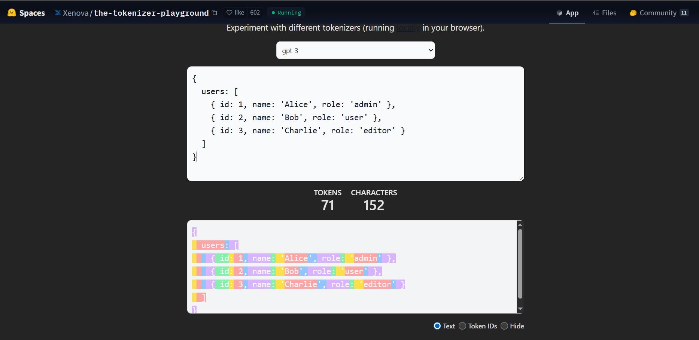
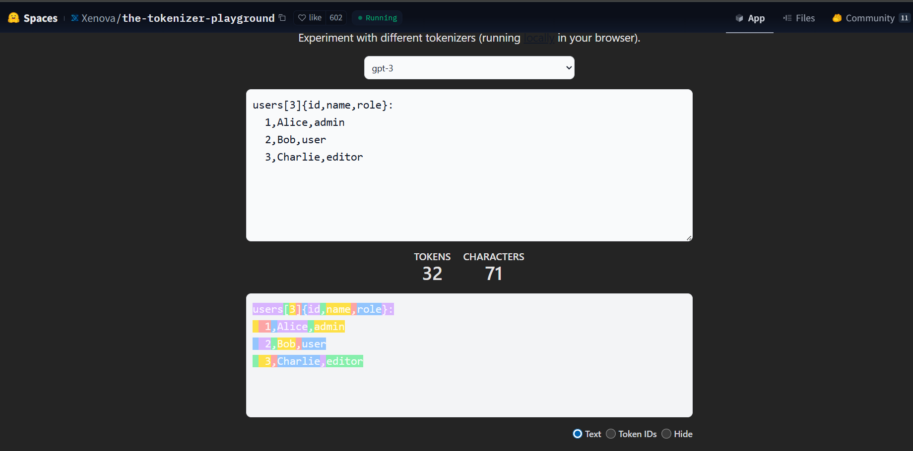

# TOON
## Why is this topic relevant?

When I was working on JWT Pizza. I was thinking about how we can include AI with Devops, especially in our application.
That is when I came across TOON. I thought it would be an interesting metric for some future apps I will work on. Also, I
thought about ways to integrate AI in an inexpensive and efficient way. 

## Introduction

Data interchange formats are essential for modern applications to communicate effectively. 
The most popular format is JSON (JavaScript Object Notation). With AI, many startups and companies
have to cost manage their data because they are being charged by token. This is where TOON (Token Object-Oriented Notation) 
comes into play. TOON is a data interchange format designed to be straightforward to read and write with a less
token cost than JSON.
This report explores the advantages of TOON over other formats like JSON.

## TOON (Token Object-Oriented Notation)

- TOON is a human-readable encoding of the JSON data model optimized for low token usage. It is intended to be used in 
LLM scenarios where the token cost is a concern.
- TOON combines YAML's indentation for nested objects and CSV style for uniform arrays.
- The idea of using TOON is to use it as a translation layer between JSON and LLMs.
- TOON shouldn't be used as a replacement for JSON, it is for scenarios with uniform arrays and for not deeply irregular data.

## Example of how TOON is used

Imagine we have the following JSON data representing a list of users:

```javascript
{
  "users": [
    {
      "id": 1,
      "name": "Alice",
      "role": "admin"
    },
    {
      "id": 2,
      "name": "Bob",
      "role": "user"
    },
    {
      "id": 3,
      "name": "Charlie",
      "role": "editor"
    }
  ]
}
```

We will use GPT-3 as our LLM. If we were to send this JSON data to GPT-3, The token amount would be the following:



We will first install it in our local machine. We can do it by running the following command:

```
# npm
npm install @toon-format/toon

# pnpm
pnpm add @toon-format/toon

# yarn
yarn add @toon-format/toon
```

In our program then we can use the following code from the TOON package:

```javascript
import { toon } from "@toon-format/toon";

const data =
    {
        "users": [
            {
                "id": 1,
                "name": "Alice",
                "role": "admin"
            },
            {
                "id": 2,
                "name": "Bob",
                "role": "user"
            },
            {
                "id": 3,
                "name": "Charlie",
                "role": "editor"
            }
        ]
    }


console.log(encode(data))

// Output:
// users[3]{id,name,role}:
// 1,Alice,admin
// 2,Bob,user
// 3,Charlie,editor

```

With the encoded data, we can send it to GPT-3 and get the following response:



From the response, we can see that the token usage is almost half the cost of the JSON data.

## How to use TOON in JWT Pizza Application

If we integrate AI into our application, we can create a performance metric that measures the token usage
of our application. By implementing this metric within our CI/CD pipeline, we establish a quality gate that treats
token efficiency just like code coverage.

For example, we can use a script that imports our router and measures the token savings of the actual documented responses.
We will use the orderRouter as an example:

```javascript

const { toon } = require("@toon-format/toon");
const orderRouter = require('../routes/orderRouter');

let totalJson = 0;
let totalToon = 0;

orderRouter.docs.forEach((endpoint) => {
    if (endpoint.response) {
        const json = JSON.stringify(endpoint.response);
        const encoded = toon.encode(endpoint.response);

        totalJson += json.length;
        totalToon += encoded.length;
    }
});

const globalSavings = ((totalJson - totalToon) / totalJson) * 100;
console.log(`TOTAL SAVINGS: ${globalSavings.toFixed(2)}%`);
```

After creating this script, we need to add it in our pipeline and check the token savings.

```yaml
      - name: Install dependencies
        run: npm ci

      - name: Verify TOON Optimization
        run: |
          npm install @toon-format/toon
          node src/scripts/measureToon.js

      - name: Lint
        run: npm run lint
```

## Conclusion

By implementing a TOON quality gate in our applications, we can
elevate the quality of our applications while optimizing token usage. This approach not only enhances performance but also
ensures cost efficiency when integrating AI services.

