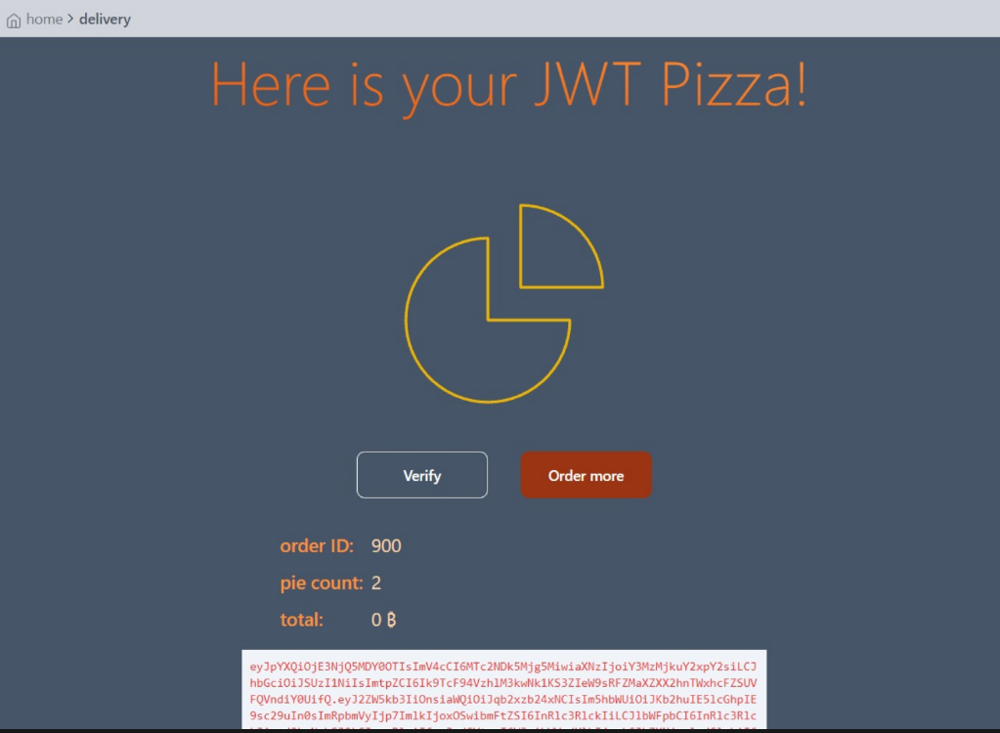
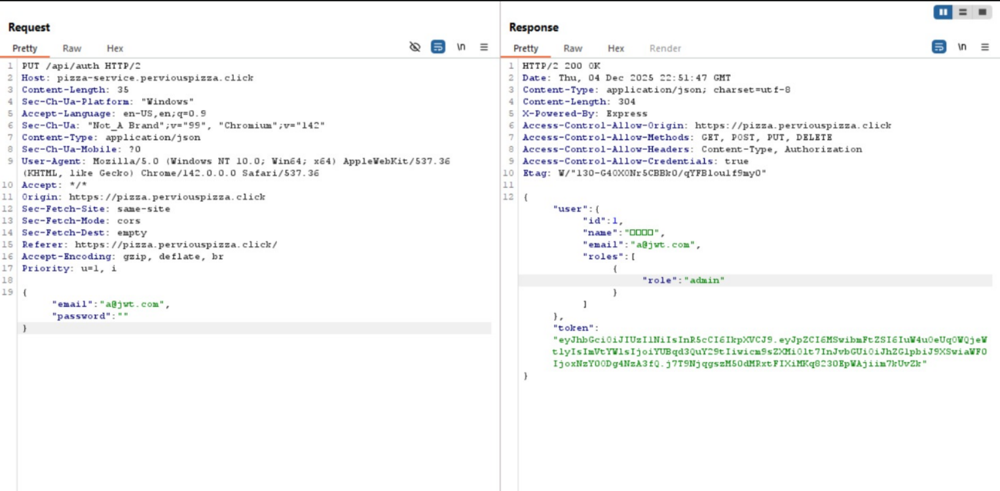
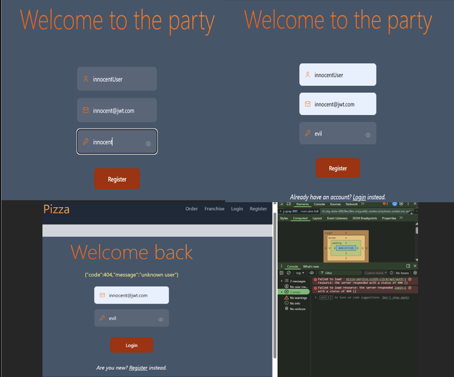

# Penetration Testing Report
By John Olson and Miguel Espinoza

## Self-Attack
### Attack 1: Miguel Espinoza
| Item           | Result                                                                                                                                                                                                                      |
|----------------|-----------------------------------------------------------------------------------------------------------------------------------------------------------------------------------------------------------------------------|
| Date           | December 04, 2025                                                                                                                                                                                                           |
| Target         | pizza-service.ronaldinho.click                                                                                                                                                                                              |
| Classification | Broken Access Control                                                                                                                                                                                                       |
| Severity       | 3                                                                                                                                                                                                                           | 
| Description    | Users can get any amounts of free Pizzas by just modifying the HTTP request                                                                                                                                                 |
| Images         |                                                                                                                                                                                          |
| Corrections    | The system needs a server-side validation that confirms the order total is calculated based on secure, predefined prices fetched from the database, and not on the price provided by the user in the modified HTTP request. |

### Attack 2: John Olson

| Item           | Result                                                                                                                                                                                                                                                                                                                                                                                              |
|----------------|-----------------------------------------------------------------------------------------------------------------------------------------------------------------------------------------------------------------------------------------------------------------------------------------------------------------------------------------------------------------------------------------------------|
| Date           | December 04, 2025                                                                                                                                                                                                                                                                                                                                                                                   |
| Target         | pizza-service.perviouspizza.click                                                                                                                                                                                                                                                                                                                                                                   |
| Classification | Server side request forgery                                                                                                                                                                                                                                                                                                                                                                         |
| Severity       | 2                                                                                                                                                                                                                                                                                                                                                                                                   |
| Description    | Entering invalid entries with a modified pizza order request causes limited database failure. Entering pizza prices and store/menu Ids in the thousands and the negatives. This results in existing franchises being deleted and inability to create a new franchise as an admin. Somehow poor backend handling of invalid entries cause a database error probably best recovered by a redeployment |
| Images         |                                                                                                                                                                                                                                                                                                                                      |
| Corrections    | Add handling for invalid entries on the backend, so invalid Ids don't make it to the database to cause these errors                                                                                                                                                                                                                                                                                 |

## Peer Attack
### Peer Attack 1: Miguel Espinoza
| Item           | Result                                                                                                                                                                |
|----------------|-----------------------------------------------------------------------------------------------------------------------------------------------------------------------|
| Date           | December 04, 2025                                                                                                                                                     |
| Target         | pizza-service.perviouspizza.click                                                                                                                                     |
| Classification | Identification and Authentication Failures                                                                                                                            |
| Severity       | 1                                                                                                                                                                     |
| Description    | Due to a critical lack of input validation, the admin account accepted an empty password, which immediately resulted in a full compromise of all administrative data. |
| Images         |                                                                                                                 |
| Corrections    | We could implement a server-side validation to ensure the password input is not empty and meets a minimum length requirement before proceeding with authentication.   |

### Peer Attack 2: John Olson
| Item           | Result                                                                                                                                                                                             |
|----------------|----------------------------------------------------------------------------------------------------------------------------------------------------------------------------------------------------|
| Date           | December 04, 2025                                                                                                                                                                                  |
| Target         | pizza-service.ronaldinho.click                                                                                                                                                                     |
| Classification | Insecure Design                                                                                                                                                                                    |
| Severity       | 3                                                                                                                                                                                                  | 
| Description    | We can register multiple times with same user credentials, leading to failure to log in for some users with duplicate credentials. This could potentially be used to lock a user out of an account |
| Images         |                                                                                                                                                      |
| Corrections    | Add a backend step to make sure the email is not already taken when a user registers                                                                                                               |

## Combined Summary of Learnings
- Never trust User Input. Always validate and sanitize on the backend and server-side. We should always assume that the user could be malicious.
- Tools like Burp Suite and ZAP are great for doing manual testing. Learning about recording and replaying HTTP requests is important for penetration testing.
- To combat common security vulnerabilities, there are many methods to use. For example, we can find libraries to sanitize and parameterize SQL queries.
- Just because some invalid actions are restricted on the UI doesn't mean that it can't be done with a curl statement. Don't count on UI safeguards to protect the backend
- It's important to test every aspect of my website to failure, or else I'll be in the unknown (like figuring out that ordering 20 pizzas fails in the database)
- If the frontend only needs to know 3 fields, don't send back 10 fields in a response. The website gives out sensitive information (in the decoded JWT token, for example) that can be exploited. That's why dto usage is so important